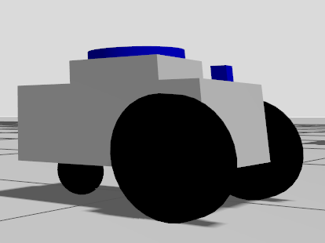
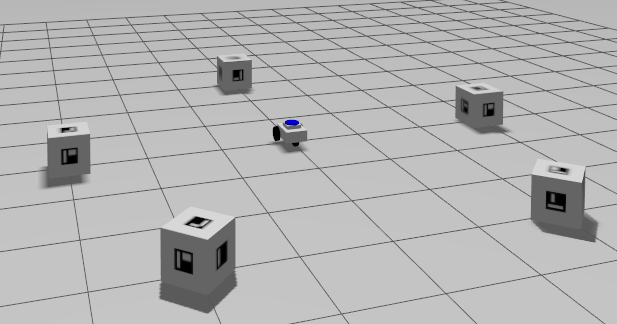
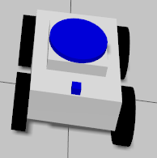

# Experimental Robotics Laboratory - Assignment 1

### Authors

**Rubin Khadka Chhetri**  
`Student ID: 6558048`  
[](https://github.com/rubin-khadka)

**Sarvenaz Ashoori**  
`Student ID: 6878764`  
[](https://github.com/sarvenazrobotics)

**Abdul Hayee Hafiz**  
`Student ID: 6029926`  
[](https://github.com/abdulhayee181)

## Table of Contents
- [Introduction](#introduction)
- [Robot Platforms & Simulation Environment](#robot-platforms--simulation-environment)
- [Video Demonstrations](#video-demonstrations)
- [Getting Started](#getting-started-read-before-action) 
- [Video Demonstrations](#video-demonstrations)
- [Getting Started](#getting-started-read-before-action)
    - [Prerequisites](#prerequisites)
    - [Setup](#setup)
- [Launching the System](#launching-the-system)
    - [Launch the Robot with Gazebo Environment](#launch-the-robot-with-gazebo-environment)
    - [Launch the Marker Detection Node](#launch-the-marker-detection-node)
- [Implementation Details](#implementation-details)
    - [Development of the Robot](#development-of-the-robot)
    - [Marker Detection Process](#marker-detection-process)
    - [Visual Servoing Control](#visual-servoing-control)
- [Project Structure](#project-structure)
- [Summary](#summary)

## Introduction

This assignment implements a comprehensive marker detection and visual servoing system using **ROS 2**, **OpenCV**, and **ArUco markers**. The system is designed to operate with two different robot configurations (differential drive and skid-steer drive) to detect, identify, and navigate to markers in a structured environment. The robot sequentially identifies all markers, then navigates to each marker in ascending ID order while maintaining visual servoing control to keep the marker centered in the camera view.

## Robot Platforms & Simulation Environment

### Differential Drive Robot
 <br>
*Features two driven wheels at front and a caster wheel at back*

 <br> 
*Two-wheeled robot spawned in Gazebo environment with 5 ArUco markers*

### Skid-Steer Robot
 <br>
*Features four wheels with skid-steer drive controller*

 <br> 
*Four-wheeled robot spawned in identical Gazebo environment with 5 ArUco markers*

## Video Demonstrations

### Video 1: Skid-Steer Robot Implementation
https://github.com/user-attachments/assets/58ca94b2-befd-46fd-aff9-702826df26b8

The demonstration shows the complete system operation with three synchronized views:
    
1. **Gazebo Simulation** (Left): Four-wheeled skid-steer robot navigating among 5 ArUco markers.
2. **OpenCV Processing** (Top Right): Real-time visualization of:
    - Marker detection and identification
    - Visual servoing for centering control
    - Search behavior during marker scanning
3. **RQT Image View** (Bottom Right): Live feed from /processed_image topic showing circled markers as required.

### Video 2: Differential Drive Robot Implementation
https://github.com/user-attachments/assets/b9dd85f6-75f3-49bc-9c51-9b31dd8f99d5

This demonstration features the two-wheeled differential drive robot with caster wheel:

1. **Gazebo Simulation** (Left): Two-wheeled robot with caster wheel navigating the marker environment.
2. **OpenCV Processing** (Top Right): Real-time marker detection and visual servoing visualization.
3. **Terminal View** (Bottom Right): Node execution output showing:
    - Real-time feedback and status updates
    - Marker detection notifications
    - Control system feedback for user monitoring
    - Sequential navigation progress through marker IDs

## Getting Started (Read Before Action)

### Prerequisites
---
Before proceeding, make sure that **`ROS2 Jazzy`** is installed on your system.<br>
If you haven’t set up ROS2 yet, refer to the official installation guide for ROS2 Jazzy on Ubuntu:<br>
[Install ROS2 Jazzy](https://docs.ros.org/en/jazzy/Installation.html) <br>

**Additional Required Packages:**
- Gazebo
- OpenCV (with ArUco module)
- `ros_gz_bridge`
- `cv_bridge`
- `robot_state_publisher`
- `robot_localization`

### Setup 
---
#### 1. Set up your ROS workspace
Create a new workspace (or use an existing one) and navigate to its `src` directory:
```bash
mkdir -p ~/aruco_ws/src
cd ~/aruco_ws/src
```

#### 2. Clone this repository
Clone this repository into your workspace’s `src` folder:
```bash
git clone https://github.com/rubin-khadka/aruco_marker_robot.git
```

#### 3. Build the workspace
Navigate back to the root of your workspace and build the packages using `colcon build`:
```bash
cd ~/aruco_ws
colcon build
```

#### 4. Source the workspace
After building, source the workspace manually for the first time in the current terminal session:
```bash
source ~/aruco_ws/install/setup.bash
```

#### 5. Add the Workspace to your ROS Environment
To ensure that your workspace is sourced automatically every time you start a new terminal session, add it to your `.bashrc` file:
```bash
echo "source ~/aruco_ws/install/setup.bash" >> ~/.bashrc
source ~/.bashrc
```

## Launching the System

### Launch the Robot with Gazebo Environment
---
You can run the assignment with two different robot configurations:

#### Option 1: Two-Wheeled Caster Robot
```bash
ros2 launch aruco_marker_robot aruco_world.launch.py 
```
#### Option 2: Four-Wheeled Skid-Steer Robot
```bash
ros2 launch aruco_marker_robot diff_aruco_world.launch.py 
```
**Both configurations will:**
- Spawn the robot in a Gazebo world with 5 ArUco markers
- Launch RViz for visualization

### Launch the Marker Detection Node
---
After launching the simulation, run the marker processor:
```bash
ros2 run aruco_marker_robot aruco_marker_processor 
```
**This node will:**
- Automatically rotate the robot 360° to detect all markers
- Sort markers by ID (lowest to highest)
- Center each marker in the camera view using visual servoing
- Publish processed images with circles to `/processed_image` topic
- Wait 5 seconds at each centered marker before moving to the next

To see the processed image (marker detection with circles) topic `/processed_image` use: `rqt`

## Implementation Details

### Development of the Robot
---
#### Robot Design & Custom Development
- Custom Built Robot: Developed from scratch specifically for this assignment
- Inspiration Reference: Initial design inspired by [MOGI-ROS/Week-3-4-Gazebo-basics](https://github.com/MOGI-ROS/Week-3-4-Gazebo-basics)
- Significant Modifications: Extensive customizations beyond the reference implementation

#### URDF Structure & Configurations
- Dual Configuration Support: System supports both two-wheel and four-wheel robot variants
- Two-Wheel Version: Standard differential drive with caster wheel
- Four-Wheel Version: Skid-steer configuration with enhanced stability
- Modular Design: Same sensor suite and control interfaces for both configurations

#### Sensor Suite & Capabilities
- Vision System: RGB camera for ArUco marker detection
- Inertial Measurement: IMU provides orientation and angular velocity
- Localization: EKF sensor fusion available (odometry/IMU)
- Interchangeable: All sensors function identically across both robot versions

#### Control System
- Unified Interface: Both robots use `/cmd_vel` topic for velocity commands
- Gazebo Plugins: Appropriate differential drive controllers for each configuration
- Sensor Topics: Consistent ROS 2 message interfaces
- Assignment Compatibility: Marker detection and visual servoing work identically on both platforms

### Marker Detection Process
---
#### State Machine Workflow
- SCANNING: Robot rotates 360° using IMU, collects all marker IDs
- SORTING: Organizes detected markers by ID in ascending order
- SEARCHING: Rotates to find current target marker
- CENTERING: Visual servoing to center marker + 5-second dwell
- COMPLETE: All markers processed, mission finished

#### Initial Scanning Phase
- Robot performs 360° rotation using IMU angular velocity integration
- Camera captures images at 10Hz rate during rotation
- OpenCV ArUco detector identifies all visible markers and their IDs
- Detected marker IDs are stored in a set to avoid duplicates

#### Image Processing Pipeline
- Each frame is converted from ROS Image to OpenCV format using cv_bridge
- `cv::aruco::detectMarkers()` processes the image to find ArUco markers
- For each detected marker, the function returns:
    - Marker ID (unique identifier)
    - Four corner coordinates (pixel positions)
- Marker centers are calculated by averaging the four corner points

#### Visual Overlay & Publishing
- Processed images are created by cloning the original frame
- `cv::aruco::drawDetectedMarkers()` draws marker borders and IDs
- Green circles (25px radius) are drawn around calculated marker centers
- Final processed images are published to `/processed_image` topic

#### Sequential Processing
- After scanning, markers are sorted by ID in ascending order
- Robot searches for each marker sequentially using visual servoing
- When marker is centered, processed images with circles are continuously published
- 5-second dwell time allows observation before moving to next marker
- Automatic Progression: System automatically moves to next marker after dwell time

### Visual Servoing Control
---
#### Error Calculation
- Image Center: `(image_width/2, image_height/2)` - fixed reference point
- Marker Center: Average of 4 detected corner coordinates from ArUco detection
- Horizontal Error: `error_x = marker_center_x - image_center_x`
- Vertical Monitoring: Error in Y-direction is monitored but not used for control

#### Control Law
- Proportional Controller: `angular_velocity = -Kp * error_x`
- Gain Tuning: `Kp = 0.01` (empirically determined for smooth rotation)
- Sign Convention: Negative sign ensures correct rotation direction
    - Positive error (marker right of center) → negative angular velocity (turn right)
    - Negative error (marker left of center) → positive angular velocity (turn left)

## Project Structure
```bash
aruco_marker_robot/
├── launch/
│   ├── aruco_world.launch.launch.py
│   └── diff_aruco_world.launch.launch.py
├── gazebo_models/
│   └── aruco_box/
├── src/
│   └── aruco_marker_processor.cpp
├── urdf/
│   ├── diff_marker_follower_robot.gazebo
│   ├── diff_marker_follower_robot.urdf
│   ├── marker_follower_robot.gazebo
│   ├── marker_follower_robot.urdf
│   └── materials.xacro
├── worlds/
│   └── marker_world.sdf
├── config/
│   ├── bridge_parameters.yaml
│   └── ekf.yaml
├── rviz/
│   └── visualize.rviz
├── assets/
│   ├── gazeboenv.png
│   ├── robot_caster.png
│   ├── robot_diff.png
│   ├── two_wheel.png
│   ├── demo_four_wheeled.mp4
│   └── demo_two_wheeled,mp4
├── CMakeLists.txt
├── package.xml
└── README.md
```

### Directory Overview:

- **`launch/`**: ROS 2 launch files for simulation environments
    - `aruco_world.launch.py`: Launches two-wheeled robot in marker world
    - `diff_aruco_world.launch.py`: Launches four-wheeled differential drive robot
- **`gazebo_models/`**: Contains ArUco marker models for Gazebo simulation
    - `aruco_box/`: Marker cube models with different IDs
- **`src/`**: C++ source code implementation
    - `aruco_marker_processor.cpp`: Main node for marker detection and visual servoing
- **`urdf/`**: Robot description files
    - `marker_follower_robot.urdf & .gazebo`: Two-wheeled robot with caster wheel
    - `diff_marker_follower_robot.urdf & .gazebo`: Four-wheeled skid-steer robot
    - `materials.xacro`: Visual properties for robot models
- **`worlds/`**: Simulation environment
    - `marker_world.sdf`: Gazebo world with 5 ArUco markers in circular arrangement
- **`config/`**: Configuration files
    - `bridge_parameters.yaml`: ROS-Gazebo bridge settings
    - `ekf.yaml`: Extended Kalman Filter parameters
- **`rviz/`**: Visualization configuration
    - `visualize.rviz`: RViz setup for robot and sensor data visualization
- **`assets/`**: Media files for documentation
    - `Images`: Robot models and simulation screenshots
    - `Videos`: Demonstration of both robot implementations
- **`CMakeLists.txt`**: Build configuration for ROS 2 package
- **`package.xml`**: Package manifest and dependency management

## Summary
This implementation successfully addresses both the core requirements and optional components of Assignment 1, providing a robust framework for marker detection and visual servoing in both simulation and real-world scenarios.

**Features Delivered:**
- Dual robot platform support (differential & skid-steer)
- ArUco marker detection
- Visual servoing
- Sequential navigation to markers
- Comprehensive documentation

**Course**: Experimental Robotics Laboratory  
**Year**: 2025 <br>
**Status**: Assignment Completed
